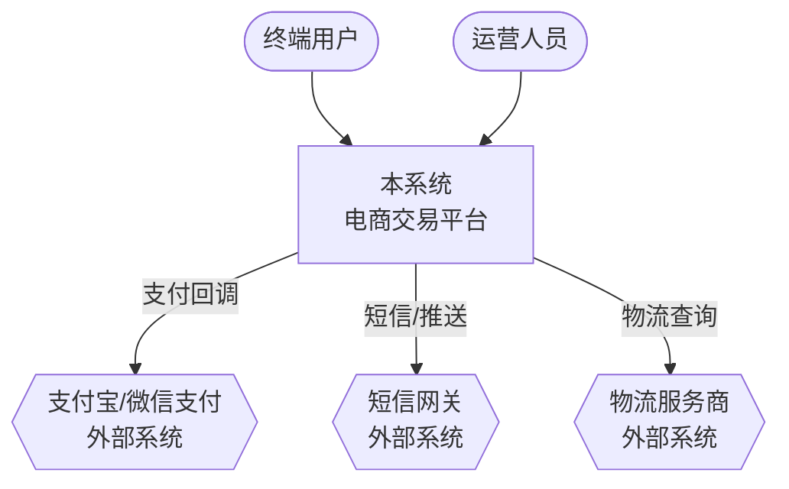
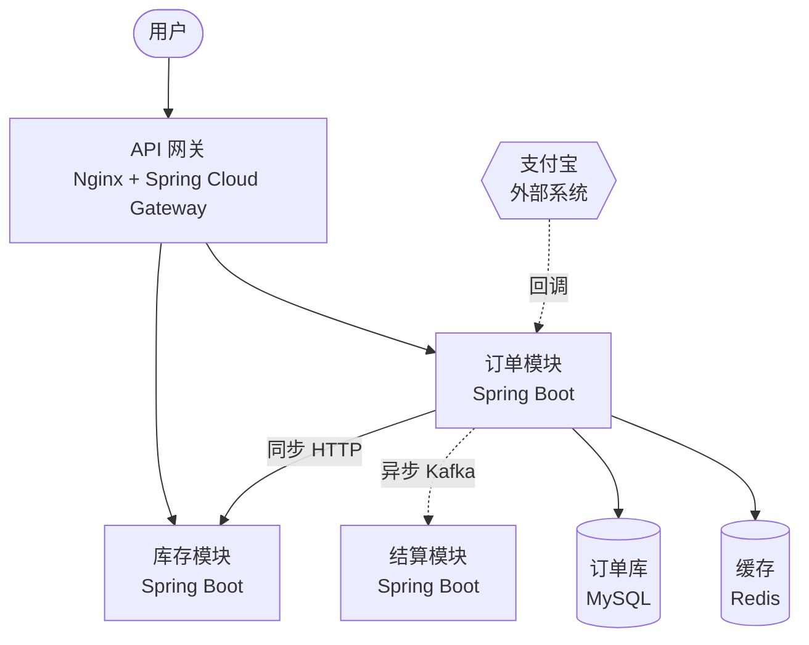
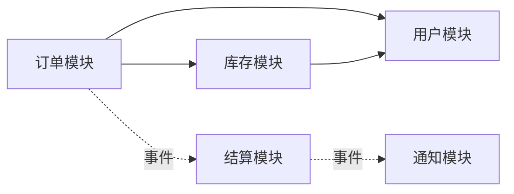
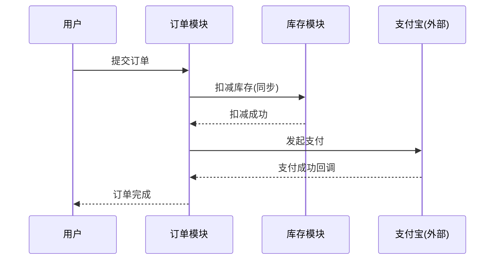
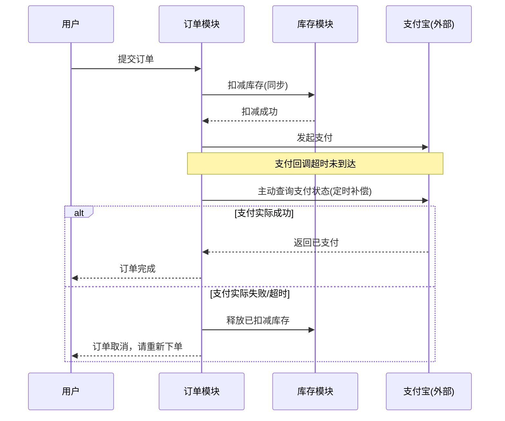
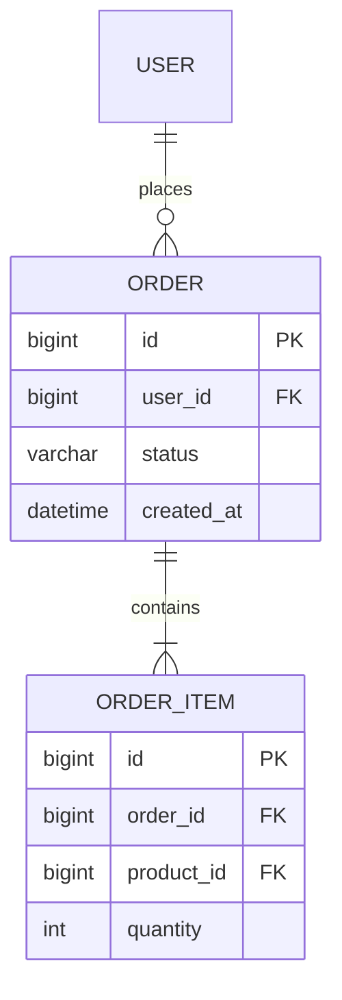
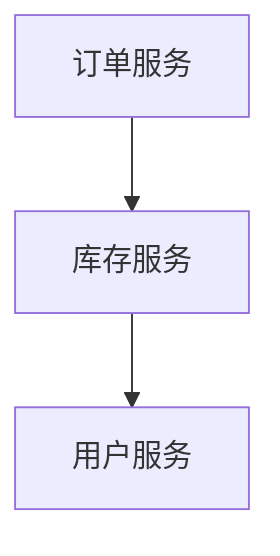

# Architect Skill Implementation Plan

> **For agentic workers:** REQUIRED SUB-SKILL: Use superpowers:subagent-driven-development (recommended) or superpowers:executing-plans to implement this plan task-by-task. Steps use checkbox (`- [ ]`) syntax for tracking.

**Goal:** 构建并发布一个名为 `architect` 的 Claude Code 插件，其中包含一个同名 skill，能够理解用户的需求/场景描述，通过澄清问题收敛信息，并产出含模块划分与 Mermaid 架构图的系统架构设计文档。

**Architecture:** 单仓库既是插件又是自带 marketplace（`.claude-plugin/plugin.json` + `.claude-plugin/marketplace.json`，`source: "./"`）。技能主体 `skills/architect/SKILL.md` 只放五阶段流程与三道硬性门禁；具体领域知识（澄清问题、架构风格库、技术选型矩阵、模块划分方法论、图表规范、文档模板）拆分到 `skills/architect/references/*.md`，SKILL.md 用 `${CLAUDE_PLUGIN_ROOT}` 绝对路径引用，按阶段需要才读取。

**Tech Stack:** 纯 Markdown + YAML frontmatter + JSON（plugin manifest）+ Mermaid（图表）。校验工具：Python 3.12（含 PyYAML，用于 YAML/JSON 结构校验）、Node.js（JSON 校验备用）、`claude plugin validate`（官方插件校验命令）。

**Spec:** `docs/superpowers/specs/2026-09-16-architect-skill-design.md`

**这是内容/文档项目，非传统代码项目 —— 测试方式的说明：**
本计划将 superpowers:writing-plans 的 TDD 结构适配为文档场景：
- 「失败测试」= 校验脚本在文件写入前必然报错（文件不存在/JSON 不合法）
- 「实现」= 写入完整文件内容
- 「测试通过」= 校验脚本通过（JSON/YAML 合法、必需字段存在、frontmatter 可解析）
- 最后一个任务是端到端功能压力测试：dispatch 一个 subagent 真实使用这个 skill，验证三道门禁没有被绕过——这是本项目真正等价于"集成测试"的部分。

## Global Constraints

- 插件名固定为 `architect`，技能安装后引用名为 `architect:architect`
- 仓库目标地址：`https://github.com/yao14728/architect`
- 作者信息：`name: yaofengqiao`, `email: 1947846708@qq.com`
- License: MIT
- SKILL.md 内引用 references 文件必须用 `${CLAUDE_PLUGIN_ROOT}/skills/architect/references/<file>.md` 绝对路径，禁止相对路径
- SKILL.md frontmatter 的 `description` 用英文书写并嵌入中文触发关键词；正文与 references 以中文为主，架构术语保留英文原词
- 生成的架构设计文档落在**用户项目**的 `docs/arch/YYYY-MM-DD-<系统名>-架构设计.md`，不是本插件仓库路径
- 每个文件写完立即做结构校验并提交（小步提交，禁止一次性攒多个文件再提交）
- 不引入任何构建工具/包管理依赖——这是纯 Markdown/JSON 插件，`package.json` 不需要

---

### Task 1: 插件清单与仓库脚手架

**Files:**
- Create: `.gitignore`
- Create: `LICENSE`
- Create: `.claude-plugin/plugin.json`
- Create: `.claude-plugin/marketplace.json`
- Test: 内联校验脚本（无独立测试文件，校验命令见步骤）

**Interfaces:**
- Consumes: 无（本任务无前置依赖）
- Produces: `.claude-plugin/plugin.json` 的 `name` 字段值 `"architect"` —— Task 2-9 的 SKILL.md 与 references 路径拼接都依赖这个插件名；`marketplace.json` 中 `plugins[0].source` 值 `"./"` —— 决定本地调试安装路径

- [ ] **Step 1: 编写 .gitignore**

```gitignore
# OS
.DS_Store
Thumbs.db

# Editor
.vscode/
.idea/

# Node (仅防止误用，本项目不依赖 node_modules)
node_modules/

# 本地临时文件
*.tmp
*.log
```

- [ ] **Step 2: 编写 LICENSE（MIT）**

```text
MIT License

Copyright (c) 2026 yaofengqiao

Permission is hereby granted, free of charge, to any person obtaining a copy
of this software and associated documentation files (the "Software"), to deal
in the Software without restriction, including without limitation the rights
to use, copy, modify, merge, publish, distribute, sublicense, and/or sell
copies of the Software, and to permit persons to whom the Software is
furnished to do so, subject to the following conditions:

The above copyright notice and this permission notice shall be included in all
copies or substantial portions of the Software.

THE SOFTWARE IS PROVIDED "AS IS", WITHOUT WARRANTY OF ANY KIND, EXPRESS OR
IMPLIED, INCLUDING BUT NOT LIMITED TO THE WARRANTIES OF MERCHANTABILITY,
FITNESS FOR A PARTICULAR PURPOSE AND NONINFRINGEMENT. IN NO EVENT SHALL THE
AUTHORS OR COPYRIGHT HOLDERS BE LIABLE FOR ANY CLAIM, DAMAGES OR OTHER
LIABILITY, WHETHER IN AN ACTION OF CONTRACT, TORT OR OTHERWISE, ARISING FROM,
OUT OF OR IN CONNECTION WITH THE SOFTWARE OR THE USE OR OTHER DEALINGS IN THE
SOFTWARE.
```

- [ ] **Step 3: 编写 .claude-plugin/plugin.json**

```json
{
  "name": "architect",
  "version": "1.0.0",
  "description": "Architect skill: understands requirements and scenarios, then designs system architecture with module breakdown and diagrams",
  "author": {
    "name": "yaofengqiao",
    "email": "1947846708@qq.com"
  },
  "homepage": "https://github.com/yao14728/architect",
  "repository": {
    "type": "git",
    "url": "https://github.com/yao14728/architect"
  },
  "license": "MIT",
  "keywords": [
    "architecture",
    "system-design",
    "skills",
    "architecture-diagram",
    "架构设计",
    "系统架构",
    "需求拆解"
  ],
  "skills": "./skills"
}
```

- [ ] **Step 4: 编写 .claude-plugin/marketplace.json**

```json
{
  "name": "architect-marketplace",
  "owner": {
    "name": "yaofengqiao",
    "email": "1947846708@qq.com"
  },
  "description": "Marketplace for the architect skill plugin",
  "plugins": [
    {
      "name": "architect",
      "description": "Architect skill: understands requirements and scenarios, then designs system architecture with module breakdown and diagrams",
      "version": "1.0.0",
      "source": "./",
      "author": {
        "name": "yaofengqiao",
        "email": "1947846708@qq.com"
      }
    }
  ]
}
```

- [ ] **Step 5: 校验两份 JSON 合法且关键字段正确**

Run:
```bash
python -c "
import json
p = json.load(open('.claude-plugin/plugin.json', encoding='utf-8'))
assert p['name'] == 'architect', p['name']
assert p['skills'] == './skills', p['skills']
assert p['license'] == 'MIT'
m = json.load(open('.claude-plugin/marketplace.json', encoding='utf-8'))
assert m['plugins'][0]['name'] == 'architect'
assert m['plugins'][0]['source'] == './'
print('plugin.json / marketplace.json 校验通过')
"
```
Expected: 打印 `plugin.json / marketplace.json 校验通过`，无 AssertionError

- [ ] **Step 6: Commit**

```bash
git add .gitignore LICENSE .claude-plugin/
git commit -m "chore: 插件清单与仓库脚手架"
```

---

### Task 2: SKILL.md 主流程

**Files:**
- Create: `skills/architect/SKILL.md`
- Test: 内联 YAML frontmatter 校验脚本

**Interfaces:**
- Consumes: Task 1 产出的插件名 `architect`（用于路径拼接 `${CLAUDE_PLUGIN_ROOT}/skills/architect/...`）
- Produces: 供 Task 3-8 的 references 文件被引用的六个固定文件名——`clarifying-questions.md`、`architecture-styles.md`、`tech-selection.md`、`module-decomposition.md`、`diagram-patterns.md`、`document-template.md`（必须与本任务 SKILL.md 中写的文件名逐字一致）

- [ ] **Step 1: 编写 skills/architect/SKILL.md**

```markdown
---
name: architect
description: Use when designing system architecture from requirements — new systems from scratch, adding modules to existing codebases, reviewing/refactoring existing architecture, or comparing technology options. Triggers include 需求拆解、系统设计、模块划分、架构图、技术选型、微服务拆分、架构评审、系统设计文档.
allowed-tools: Read, Glob, Grep, Write, Edit, Bash, WebSearch, WebFetch, AskUserQuestion
---

# Architect

## 总览

本技能扮演系统架构师：理解需求与使用场景，拆解为架构决策点，产出包含模块划分
与架构图的架构设计文档。核心原则——**复杂度必须被量化指标证明**：默认从满足
约束的最简架构起步，不做"大厂都这么做"式的过度设计。

领域知识（架构风格、选型矩阵、模块划分方法论、图表规范、文档模板）拆分在
`references/` 下按阶段加载，避免把全部内容塞进本文件。所有引用一律使用绝对路径
`${CLAUDE_PLUGIN_ROOT}/skills/architect/references/<file>.md`，禁止相对路径。

## 场景路由

开始前先判断落在哪个场景：

| 场景识别信号 | 起点动作 |
|---|---|
| 从零开始的新系统/新项目 | 直接进入「五阶段流程」阶段 1 |
| 现有代码库中新增模块/子系统 | 先用 Glob/Grep/Read 扫描代码库的分层结构、技术栈、命名与包约定、现有模块边界，再进入阶段 1；新设计必须与现状兼容 |
| "系统很慢/很乱/改不动了"类诉求 | 先扫描代码库 + 询问痛点（哪里疼、何时疼、持续多久），跳过阶段 3 的方案选型，直接走"现状 → 问题归因 → 演进路线"，仍产出 9 章文档但第 3 章替换为问题分析 |
| 单纯的技术选型对比（"该用 A 还是 B"） | 轻量路径：只做阶段 2（约束量化）+ 读 `references/tech-selection.md` 给对比矩阵与推荐，不生成完整 9 章文档 |

## 五阶段流程

### 阶段 1 · 需求理解

1. 解析用户输入（对话描述 / PRD 文档 / 现有代码库）
2. 提取：业务目标、核心用例、用户角色、关键流程
3. 读 `${CLAUDE_PLUGIN_ROOT}/skills/architect/references/clarifying-questions.md`，
   挑选**真正影响架构决策**的缺失项（能从需求描述里推断出的不用问）
4. 用 AskUserQuestion 一次问 3-4 个问题，带推荐选项
5. 输出「需求理解确认」：理解的目标 / 核心用例清单 / 已确认约束 / 假设列表

**门禁 1：** 用户未确认理解结果之前，不允许进入阶段 3（方案选型）。不能用
"我假设一下"跳过确认。

### 阶段 2 · 约束与质量属性量化

把模糊描述换算成数字：

- 规模：DAU / MAU、峰值 QPS、数据量与增速
- 性能：响应时间要求（P95/P99）
- 可靠性：可用性目标（SLA）、一致性要求（强一致 / 最终一致）
- 团队：规模、技术栈熟悉度
- 项目：工期、预算、合规要求（等保 / GDPR 等）

没有数字时，给出数量级估算并显式标注为"假设，待确认"。这些数字是阶段 3-4
一切决策的依据，不可用"看情况"代替。

### 阶段 3 · 架构方案选型

读 `${CLAUDE_PLUGIN_ROOT}/skills/architect/references/architecture-styles.md`，
给出 **2-3 个候选方案**，每个写明：

- 适用前提（对应阶段 2 的哪些量化指标）
- 优点
- 代价（运维复杂度、团队要求、成本）
- 翻车场景（什么条件下这个方案会出问题）

给出带理由的推荐，并说明被否决方案的否决原因。

**门禁 2：** 候选方案少于 2 个，不允许进入阶段 4。禁止直接给单一结论。

### 阶段 4 · 模块划分与详细设计

读 `${CLAUDE_PLUGIN_ROOT}/skills/architect/references/module-decomposition.md`
执行模块划分（方法论与反模式见该文件）。

读 `${CLAUDE_PLUGIN_ROOT}/skills/architect/references/tech-selection.md`
做具体中间件/存储/框架选型，每项写明选了什么、为什么、放弃了什么替代方案、
引入的运维成本。

**门禁 3：** 每引入一个中间件、每多拆一层/一个服务，必须在文档中写清楚是
阶段 2 的哪个量化指标驱动的。写不出来就砍掉，回退到更简单的方案。

### 阶段 5 · 出文档

读 `${CLAUDE_PLUGIN_ROOT}/skills/architect/references/diagram-patterns.md`
画架构图（Mermaid），读
`${CLAUDE_PLUGIN_ROOT}/skills/architect/references/document-template.md`
按 9 章模板组织全文。

产出文件路径：用户项目下的 `docs/arch/YYYY-MM-DD-<系统名>-架构设计.md`
（不是本插件仓库路径）。

轻量选型路径（场景路由第 4 行）跳过本阶段，直接在对话中给对比表和推荐。

## 三道硬性门禁（汇总）

1. 需求未经用户确认 → 不进入方案选型
2. 候选方案 < 2 个 → 不进入模块划分
3. 引入的复杂度说不出对应的量化指标 → 必须砍掉

这三条不因"用户很着急""需求看起来很简单"而放松。需求简单，产出的文档可以短，
但流程不能跳步。

## 模块划分速查（详见 references/module-decomposition.md）

- 划分优先级：业务能力/限界上下文 > 变化率 > 团队边界 > 技术性关注点
- 禁止：按技术分层拆服务、按表一对一拆模块、纯 CRUD 微服务
- 每个模块必须写满：职责（一句话）/ 对外接口 / 依赖方向 / 数据所有权
- 自检：一句话测试、变更测试（典型需求改动应 <3 个模块）、独立测试、所有权测试

## 架构图速查（详见 references/diagram-patterns.md）

必画四张：系统上下文图、容器图、模块依赖图、关键流程时序图（至少一条异常路径）。
节点标注技术栈，边标注协议与同步/异步，单图不超过 15 节点。

## 文档模板速查（详见 references/document-template.md）

9 章：需求与场景理解 / 质量属性与约束 / 架构方案对比 / 系统模块划分 /
架构图 / 技术选型 / 数据模型与关键流程 / 非功能设计 / 风险与演进。
第 9 章必须给可观测的触发信号，不写"未来可以微服务化"这类空话。

## 常见错误

| 错误 | 后果 | 正确做法 |
|---|---|---|
| 需求没问清楚就开始画图 | 文档基于错误假设，返工 | 走完阶段 1，拿到用户确认 |
| 只给一个方案 | 用户看不到权衡，等于没做选型 | 门禁 2 强制 ≥2 候选 |
| 一上来就微服务 | 团队 3 人却要维护 15 个服务的运维复杂度 | 门禁 3：复杂度要有量化理由 |
| 按 controller/service/dao 拆服务 | 服务间强耦合，只是加了网络延迟 | 按业务能力/限界上下文划分 |
| 图里的服务名没有技术栈 | 图没有信息增量 | 节点标注技术栈和关键协议 |
| 第 9 章写"未来考虑微服务化" | 不可执行 | 写明触发信号（如 QPS>3000 或团队>3组） |
```

- [ ] **Step 2: 校验 frontmatter 可被 YAML 解析且必需字段存在**

Run:
```bash
python -c "
import re, yaml
text = open('skills/architect/SKILL.md', encoding='utf-8').read()
m = re.match(r'^---\n(.*?)\n---\n', text, re.S)
assert m, 'frontmatter 未找到'
fm = yaml.safe_load(m.group(1))
assert fm['name'] == 'architect', fm['name']
assert fm['description'].startswith('Use when'), fm['description']
assert '需求拆解' in fm['description']
assert 'allowed-tools' in fm
print('SKILL.md frontmatter 校验通过')
"
```
Expected: 打印 `SKILL.md frontmatter 校验通过`，无 AssertionError

- [ ] **Step 3: 校验六个 references 文件名在正文中被正确引用（先于文件创建做字符串核对）**

Run:
```bash
python -c "
text = open('skills/architect/SKILL.md', encoding='utf-8').read()
names = ['clarifying-questions.md','architecture-styles.md','tech-selection.md',
         'module-decomposition.md','diagram-patterns.md','document-template.md']
missing = [n for n in names if n not in text]
assert not missing, f'SKILL.md 中缺少对这些文件的引用: {missing}'
assert text.count('\${CLAUDE_PLUGIN_ROOT}') >= 6, '引用未使用 \${CLAUDE_PLUGIN_ROOT} 绝对路径'
print('references 引用一致性校验通过')
"
```
Expected: 打印 `references 引用一致性校验通过`

- [ ] **Step 4: Commit**

```bash
git add skills/architect/SKILL.md
git commit -m "feat: 新增 architect skill 主流程"
```

---

### Task 3: references/clarifying-questions.md

**Files:**
- Create: `skills/architect/references/clarifying-questions.md`
- Test: 内联章节完整性校验脚本

**Interfaces:**
- Consumes: 无直接代码依赖；被 Task 2 的 SKILL.md 阶段 1 引用
- Produces: 五个问题分类章节标题（通用/后端/前端/数据/移动端），后续任务无依赖

- [ ] **Step 1: 编写 skills/architect/references/clarifying-questions.md**

```markdown
# 澄清问题清单

## 使用说明

每次最多问 3-4 个问题，优先选"影响架构决策"一列有具体内容的问题；能从需求
描述里直接推断出的不要问。问题请通过 AskUserQuestion 提出，并给出推荐选项，
方便用户直接选择而不必手打。

## 通用（任何场景都先问）

| 问题 | 影响的架构决策 |
|---|---|
| 目标用户规模量级（个位数/百级/万级/十万+）？ | 决定单体 vs 分布式的起步点 |
| 核心业务价值是什么，如果只能做对一件事是什么？ | 决定哪个模块是核心域，值得优先投入设计精力 |
| 期望上线时间/迭代节奏？ | 决定技术栈成熟度要求，是否有余量引入新技术 |
| 团队规模与技术栈熟悉度？ | 决定架构复杂度上限（康威定律：架构不能超出团队能维护的边界） |
| 预算与基础设施形态（自建机房/云主机/Serverless）？ | 决定部署形态候选集 |
| 是否有合规/数据主权要求（等保/GDPR/金融监管）？ | 决定数据存储位置、加密方案、审计日志设计 |

## 后端相关

| 问题 | 影响的架构决策 |
|---|---|
| 预期峰值 QPS/TPS？ | 决定是否需要缓存层、单库是否扛得住 |
| 数据总量与年增速？ | 决定是否要分库分表/冷热数据分离 |
| 一致性要求：强一致还是最终一致可接受？ | 决定是否要分布式事务/Saga，还是走最终一致消息 |
| 是否有跨多个实体的复杂事务？ | 决定相关服务边界是否要合并，避免分布式事务 |
| 读写比例？ | 决定是否要读写分离/引入 CQRS |
| 是否需要多租户？ | 决定数据隔离策略（独立库/独立 schema/行级隔离） |

## 前端相关

| 问题 | 影响的架构决策 |
|---|---|
| 目标端：Web/小程序/App/多端一致？ | 决定跨端技术方案 |
| 是否需要 SEO？ | 决定 CSR/SSR/SSG 选型 |
| 首屏性能要求？ | 决定是否要走 SSR/边缘渲染 |
| 是否需要离线可用？ | 决定 PWA/本地存储方案 |
| 浏览器兼容范围？ | 决定构建目标和 polyfill 策略 |

## 数据/AI 相关

| 问题 | 影响的架构决策 |
|---|---|
| 数据实时性要求：实时/准实时/T+1？ | 决定流处理 vs 批处理架构 |
| 数据来源是否多样（多个异构系统）？ | 决定是否需要 ETL/数据集成层 |
| 是否需要数据血缘/审计追溯？ | 决定是否要引入元数据管理组件 |
| 模型/算法是否需要在线实时推理？ | 决定是否要独立的模型服务层与特征存储 |

## 移动端相关

| 问题 | 影响的架构决策 |
|---|---|
| 是否要求跨平台（iOS+Android 共享代码）？ | 决定 React Native/Flutter 与原生开发的取舍 |
| 是否需要热更新能力？ | 决定包体结构与应用商店审核策略 |
| 弱网/离线场景占比？ | 决定本地数据库与同步冲突解决策略 |
| 是否涉及推送/后台任务？ | 决定是否需要独立的消息推送服务 |
```

- [ ] **Step 2: 校验五个分类章节均存在**

Run:
```bash
python -c "
text = open('skills/architect/references/clarifying-questions.md', encoding='utf-8').read()
sections = ['## 通用', '## 后端相关', '## 前端相关', '## 数据/AI 相关', '## 移动端相关']
missing = [s for s in sections if s not in text]
assert not missing, f'缺少章节: {missing}'
assert text.count('| 问题 | 影响的架构决策 |') == 5
print('clarifying-questions.md 结构校验通过')
"
```
Expected: 打印 `clarifying-questions.md 结构校验通过`

- [ ] **Step 3: Commit**

```bash
git add skills/architect/references/clarifying-questions.md
git commit -m "docs: 新增澄清问题清单"
```

---

### Task 4: references/architecture-styles.md

**Files:**
- Create: `skills/architect/references/architecture-styles.md`
- Test: 内联章节完整性校验脚本

**Interfaces:**
- Consumes: 无
- Produces: 九种架构风格的章节标题，供后续人工审阅一致性用；无代码依赖

- [ ] **Step 1: 编写 skills/architect/references/architecture-styles.md**

```markdown
# 架构风格库

每种风格统一五段式：定义 / 适用前提（量化门槛）/ 优点 / 真实代价 / 何时不用 + 翻车案例。
使用时至少挑 2-3 种做候选对比，不要只给一种。

## 1. 分层单体（Layered Monolith）

**定义：** 单一部署单元，内部按 Controller/Service/Repository 技术分层。

**适用前提：** 团队 ≤5 人；QPS 在个位数到几百；业务边界尚未稳定，还在快速试错阶段。

**优点：** 开发/部署/调试成本最低；事务天然一致；上手门槛低。

**代价：** 随着代码量增长，模块间边界容易腐化成"意大利面"；没有强制的模块隔离。

**何时不用：** 当团队增长到多个小组同时改同一个代码库、发布互相阻塞时，应升级为
模块化单体。翻车案例：一个 2 人团队为"以后要扩展"直接上 8 个微服务，结果每天
一半时间花在联调和部署脚本上。

## 2. 模块化单体（Modular Monolith）

**定义：** 单一部署单元，但内部按业务能力划分模块，模块间只通过定义良好的接口
调用，禁止越界访问对方的数据表。

**适用前提：** 团队 5-20 人；QPS 几百到几千；业务边界已经相对清晰，但还没有
不同的扩展性/团队独立部署的强需求。

**优点：** 兼顾单体的部署简单性和微服务的边界清晰性；未来要拆微服务时，模块
边界已经天然是服务边界候选，重构成本低。

**代价：** 需要团队自律维护模块边界（没有进程隔离强制），容易被"临时"越界调用
腐化；需要代码层面的约束工具（如包可见性、ArchUnit 类似机制）。

**何时不用：** 当不同模块需要独立的发布节奏、独立的弹性伸缩、或由完全不同技术栈
实现时，需要真正拆成微服务。**这是大多数中小型系统的默认起点，微服务不是默认项。**

## 3. 微服务（Microservices）

**定义：** 按业务能力拆分为多个独立部署、独立数据库的服务，通过网络调用协作。

**适用前提：** 团队 ≥3 个独立小组（每组能独立负责一个服务的全生命周期）；
单体已经出现明确的扩展性瓶颈或发布互相阻塞的问题；有专职的运维/平台能力
（CI/CD、服务网格、集中式日志监控）支撑。

**优点：** 独立部署、独立弹性伸缩、故障隔离、技术栈可按服务选择。

**代价：** 分布式事务/最终一致性的复杂度；网络延迟与故障处理（重试/熔断/降级）；
需要服务发现、配置中心、链路追踪、统一网关等一整套基础设施；调试和本地开发成本
显著上升。

**何时不用：** 团队 <10 人却拆成 10+ 服务，是最常见的翻车模式——大部分时间花在
运维分布式系统本身，而不是业务功能。没有可观测性基础设施就上微服务，故障定位
会变成灾难。

## 4. SOA（面向服务架构，企业服务总线）

**定义：** 通过集中式 ESB（企业服务总线）做服务间的路由、协议转换、编排。

**适用前提：** 大型企业内部有大量异构遗留系统（不同年代、不同技术栈）需要集成，
且需要统一的治理/审计能力。

**优点：** 集中治理、协议适配能力强，适合遗留系统集成场景。

**代价：** ESB 容易变成单点瓶颈和"上帝对象"，所有变更都要走总线团队排期，
迭代速度慢。

**何时不用：** 新系统之间的集成、互联网业务的快速迭代场景。现代场景通常用
轻量的 API 网关 + 事件驱动替代 ESB。

## 5. 事件驱动架构（Event-Driven Architecture, EDA）

**定义：** 服务间通过发布/订阅事件异步协作，而非同步直接调用。

**适用前提：** 业务流程涉及多个下游需要对同一事件做出反应（如"订单创建"要
通知库存、积分、推荐、通知等多个模块）；下游可以接受最终一致（秒级到分钟级延迟）。

**优点：** 服务解耦，新增下游订阅者不影响上游；天然支持削峰填谷；扩展性好。

**代价：** 调试困难（一条业务链路分散在多个异步处理器里，难以追踪）；需要处理
消息重复消费（幂等设计）、消息丢失、顺序保证等问题；最终一致意味着有短暂的
数据不一致窗口，业务上要能接受。

**何时不用：** 需要强一致、同步返回结果的场景（如扣款并立即告知余额）不适合
纯异步，这类场景应保留同步调用或用 Saga 编排。

## 6. CQRS + 事件溯源（Event Sourcing）

**定义：** 命令（写）和查询（读）模型分离，写侧以事件序列作为唯一真相来源，
读侧通过重放/订阅事件构建适合查询的视图。

**适用前提：** 读写模式差异巨大（如写入是简单的状态变更，但查询需要多维度
复杂聚合）；需要完整的操作审计追溯（金融、合规场景）；团队有能力处理事件版本
演进的复杂度。

**优点：** 读写可独立扩展和优化；天然自带完整的历史审计能力；可以随时重建
任意时间点的状态。

**代价：** 心智负担和实现复杂度显著高于传统 CRUD；事件 schema 演进管理复杂；
最终一致（读模型有延迟）。

**何时不用：** 普通 CRUD 业务、没有强审计需求、团队没有相关经验时，不要为了
"看起来先进"引入 CQRS+ES——这是本知识库里代价收益比最容易被高估的一种风格。

## 7. Serverless（FaaS）

**定义：** 业务逻辑以函数形式部署，由云平台按请求自动伸缩，用户不管理服务器。

**适用前提：** 负载波峰波谷差异大（如营销活动型流量）；团队规模小，不想负担
运维成本；单次请求处理时间短（多数平台有执行时长限制）。

**优点：** 零闲置成本（按调用计费）、自动弹性伸缩、免运维。

**代价：** 冷启动延迟；单函数执行时长/内存限制，不适合长任务；厂商锁定；
本地调试和多函数间的可观测性建设成本高；持续高流量场景下成本可能高于自建。

**何时不用：** 流量稳定且持续较高（此时包年包月的云主机/容器更便宜）；有状态、
长连接（如 WebSocket 长会话）的场景需要额外方案配合。

## 8. 微内核插件架构（Microkernel / Plugin Architecture）

**定义：** 核心系统提供最小稳定内核，业务功能以插件形式动态加载/扩展。

**适用前提：** 产品需要支持第三方扩展或高度可配置的业务规则（如 IDE、CMS、
规则引擎类产品）。

**优点：** 核心稳定，功能可插拔；第三方/不同团队可以独立开发扩展而不改动核心。

**代价：** 插件接口设计一旦定型很难变更（牵一发动全身）；插件间的依赖和版本
管理复杂。

**何时不用：** 业务功能相对固定、不需要对外开放扩展能力的场景，引入插件机制
是过度设计。

## 9. 中台（能力复用平台）

**定义：** 把多个业务线共享的核心能力（用户、交易、营销、风控等）下沉为可复用
的中台服务，前台业务基于中台能力快速搭建。

**适用前提：** 公司内有 ≥3 条业务线，且存在明显重复建设的能力（每条业务线
都在重复实现用户体系/支付/营销）。

**优点：** 避免重复造轮子，新业务线启动速度快；能力统一治理。

**代价：** 建设周期长、组织协调成本极高（需要跨团队达成能力边界共识）；中台
团队容易变成新的瓶颈，前台业务的定制化需求被中台的通用化设计拖慢。

**何时不用：** 只有 1-2 条业务线，或业务线之间共性很少时，强行搭中台是本知识库
里除 CQRS+ES 外第二容易被高估的选择——先把一条业务线做好，中台是规模化之后
的产物，不是起点。
```

- [ ] **Step 2: 校验九种风格章节齐全且每种含五段式关键词**

Run:
```bash
python -c "
text = open('skills/architect/references/architecture-styles.md', encoding='utf-8').read()
styles = ['分层单体','模块化单体','微服务','SOA','事件驱动架构','CQRS','Serverless','微内核插件架构','中台']
missing = [s for s in styles if s not in text]
assert not missing, f'缺少风格: {missing}'
for kw in ['**定义：**','**适用前提：**','**优点：**','**代价：**','**何时不用：**']:
    assert text.count(kw) == 9, f'{kw} 出现次数应为9，实际为{text.count(kw)}'
print('architecture-styles.md 结构校验通过')
"
```
Expected: 打印 `architecture-styles.md 结构校验通过`

- [ ] **Step 3: Commit**

```bash
git add skills/architect/references/architecture-styles.md
git commit -m "docs: 新增架构风格知识库"
```

---

### Task 5: references/tech-selection.md

**Files:**
- Create: `skills/architect/references/tech-selection.md`
- Test: 内联章节完整性校验脚本

**Interfaces:**
- Consumes: 无
- Produces: 十二个技术分类章节标题，供后续人工审阅一致性用；无代码依赖

- [ ] **Step 1: 编写 skills/architect/references/tech-selection.md**

```markdown
# 技术选型判据矩阵

原则：不给"哪个最好"，给"什么条件下选哪个"。每类先列选项，再给判据表。

## 关系型数据库

选项：MySQL、PostgreSQL、分布式 NewSQL（TiDB/CockroachDB）

| 条件 | 选择 |
|---|---|
| 团队最熟悉、生态最成熟、简单读写为主 | MySQL |
| 需要复杂查询（窗口函数/JSON/地理空间/全文检索）、数据完整性约束严格 | PostgreSQL |
| 单机容量/写入瓶颈已被量化指标证实（而非预测），且团队能承受运维复杂度 | 分库分表（ShardingSphere 等）或 NewSQL |
| 需要金融级强一致跨地域部署 | TiDB/CockroachDB 等分布式 NewSQL |

## NoSQL

选项：MongoDB（文档型）、Cassandra/HBase（宽列，海量写）、DynamoDB/Redis（KV）

| 条件 | 选择 |
|---|---|
| 数据结构多变、嵌套文档、快速迭代的业务模型 | MongoDB |
| 海量写入、跨机房、最终一致可接受（如日志、埋点、IM 消息） | Cassandra/HBase |
| 简单键值访问、超高读写吞吐、云托管优先 | DynamoDB（云）或自建 Redis |
| 业务本质是强关系（多表 join、事务）却选了 NoSQL | 反例——先看关系型能否满足 |

## 时序数据库

选项：InfluxDB、TimescaleDB（PostgreSQL 插件）、Prometheus（监控专用）

| 条件 | 选择 |
|---|---|
| 监控指标采集与告警 | Prometheus |
| 通用时序业务数据（IoT 传感器、金融行情） 且团队已用 PostgreSQL | TimescaleDB |
| 独立时序场景、高写入吞吐、原生时序查询语言 | InfluxDB |

## 缓存

选项：Redis（分布式）、Caffeine（本地/进程内）、Memcached

| 条件 | 选择 |
|---|---|
| 多实例间需要共享缓存状态 | Redis |
| 单机极致低延迟、数据量小、可接受多实例不一致 | Caffeine（本地缓存） |
| 只需简单 KV 缓存、无需持久化和丰富数据结构 | Memcached（多为历史系统延续，新系统优先 Redis） |
| 高并发下拿不准，先加本地缓存还是分布式缓存 | 先本地兜底热点 key，再分布式缓存兜底一致性 |

## 消息队列

选项：Kafka、RocketMQ、RabbitMQ、Pulsar

| 条件 | 选择 |
|---|---|
| 高吞吐日志/事件流、需要长期保留和多消费者重复消费 | Kafka |
| 电商/金融场景，需要事务消息、延迟消息、消息轨迹（国内生态友好） | RocketMQ |
| 复杂路由规则（topic/queue/exchange）、中小吞吐、须成熟的 AMQP 协议支持 | RabbitMQ |
| 多租户、存算分离、云原生场景 | Pulsar |
| 只是需要简单的异步解耦，QPS 不高 | 先考虑数据库表+轮询或进程内事件，不一定要上 MQ |

## API 网关

选项：Nginx（反向代理）、Kong、Spring Cloud Gateway、APISIX

| 条件 | 选择 |
|---|---|
| 只需要基础反向代理/负载均衡，无需插件生态 | Nginx |
| Java/Spring 技术栈、需要与服务发现/配置中心深度集成 | Spring Cloud Gateway |
| 多语言技术栈、需要丰富插件生态（限流/鉴权/日志） | Kong 或 APISIX |
| 云原生、追求高性能和动态配置 | APISIX |

## 注册与配置中心

选项：Nacos、Consul、Zookeeper、Eureka

| 条件 | 选择 |
|---|---|
| 需要注册发现 + 配置管理二合一，国内生态 | Nacos |
| 多数据中心、需要健康检查和 KV 存储 | Consul |
| 已有 Kafka/Hadoop 生态依赖 ZK，或需要强一致协调服务 | Zookeeper |
| 遗留 Spring Cloud Netflix 系统 | Eureka（新系统不建议，社区维护趋缓） |

## 搜索引擎

选项：Elasticsearch、Meilisearch、数据库自带全文索引

| 条件 | 选择 |
|---|---|
| 复杂聚合分析、日志检索、大数据量全文搜索 | Elasticsearch |
| 简单站内搜索、轻量部署、追求开箱即用体验 | Meilisearch |
| 搜索需求简单（模糊匹配几个字段）、数据量不大 | 数据库自带全文索引（避免引入新中间件） |

## 可观测性

选项：Prometheus+Grafana（指标）、ELK/Loki（日志）、SkyWalking/Jaeger（链路追踪）、OpenTelemetry（统一采集标准）

| 条件 | 选择 |
|---|---|
| 单体或模块化单体，运维资源有限 | 结构化日志 + 基础告警即可，暂不需要链路追踪 |
| 微服务架构 | 必须有链路追踪（SkyWalking/Jaeger），否则故障定位会灾难化 |
| 多套监控工具希望统一采集标准，避免厂商锁定 | OpenTelemetry 作为采集层，后端可换 |

## 任务调度

选项：XXL-JOB、ElasticJob、Quartz、云函数定时触发

| 条件 | 选择 |
|---|---|
| 单机定时任务，无需分布式协调 | Quartz（内嵌） |
| 需要可视化管理、失败重试、分片执行，Java 技术栈 | XXL-JOB |
| 已用当当 ElasticJob 生态或需要弹性分片 | ElasticJob |
| Serverless 架构、任务轻量 | 云函数定时触发器 |

## 前端框架与状态管理

选项：React（Redux/Zustand）、Vue（Pinia）、Svelte

| 条件 | 选择 |
|---|---|
| 团队已有 React 经验、生态要求高、大型复杂应用 | React + Zustand（简单场景）或 Redux（强规范/时间旅行调试需求） |
| 团队偏好渐进式、模板语法友好、中大型应用 | Vue + Pinia |
| 追求极致包体积和运行时性能、团队愿意接受较小生态 | Svelte/SvelteKit |
| 全局状态很少、多为局部/服务端状态 | 优先 React Query/SWR 这类服务端状态库，而非引入 Redux |

## 部署形态

选项：物理机/云主机、容器+Kubernetes、Serverless

| 条件 | 选择 |
|---|---|
| 团队规模小、服务数量少（1-5个）、无需精细弹性伸缩 | 云主机 + Docker Compose |
| 服务数量多、需要精细化资源调度和自愈能力、团队有运维能力 | Kubernetes |
| 流量波动剧烈、团队小、不想管基础设施 | Serverless（FaaS） |
| 团队没有 K8s 运维经验却选择自建 K8s 集群 | 反例——先用托管 K8s（云厂商）或先不用 K8s |
```

- [ ] **Step 2: 校验十二个分类章节齐全**

Run:
```bash
python -c "
text = open('skills/architect/references/tech-selection.md', encoding='utf-8').read()
cats = ['关系型数据库','NoSQL','时序数据库','缓存','消息队列','API 网关',
        '注册与配置中心','搜索引擎','可观测性','任务调度','前端框架与状态管理','部署形态']
missing = [c for c in cats if f'## {c}' not in text]
assert not missing, f'缺少分类: {missing}'
assert text.count('| 条件 | 选择 |') == 12
print('tech-selection.md 结构校验通过')
"
```
Expected: 打印 `tech-selection.md 结构校验通过`

- [ ] **Step 3: Commit**

```bash
git add skills/architect/references/tech-selection.md
git commit -m "docs: 新增技术选型判据矩阵"
```

---

### Task 6: references/module-decomposition.md

**Files:**
- Create: `skills/architect/references/module-decomposition.md`
- Test: 内联章节完整性校验脚本

**Interfaces:**
- Consumes: 无
- Produces: 方法论章节 + 四个行业参考划分示例，供后续人工审阅一致性用

- [ ] **Step 1: 编写 skills/architect/references/module-decomposition.md**

```markdown
# 模块划分方法论

## 核心原则

**先划逻辑模块，再定部署边界——这两件事必须分开做。** 很多架构设计一上来就
"拆几个微服务"，把逻辑边界和进程边界混成一件事。正确顺序：先按业务划出逻辑
模块，再根据量化指标（阶段 2 的约束）决定哪些模块合并进同一个部署单元。初期
常见的正确答案是"8 个逻辑模块，1 个部署单元"。

## 划分依据优先级（从上往下依次尝试）

1. **业务能力 / 限界上下文（首选）** —— 订单、库存、支付、营销这类围绕业务
   概念的边界。
2. **变化率** —— 高频变化的（营销规则、风控策略）与稳定的（账务、身份认证）
   分离，避免高频变更牵连稳定模块的发布节奏。
3. **团队边界** —— 康威定律：一个模块不应该由两个团队同时频繁修改。
4. **技术性关注点（最后考虑）** —— 网关、认证中心、通知服务这类横切能力。

## 明确禁止的反模式

- **按技术分层拆服务**：把 user-controller、user-service、user-dao 拆成三个
  独立部署的服务——这只是给同一个业务逻辑加了网络延迟，没有任何隔离收益。
- **按数据库表一对一拆模块**：表和模块不是一一对应关系，一个模块可以拥有
  多张表，但一张表只能属于一个模块。
- **纯 CRUD 微服务**：没有业务逻辑、只是对着一张表做增删改查的"服务"，
  本质是给数据库套了层不必要的网络接口。

## 每个模块必须写满的四项

| 项 | 要求 |
|---|---|
| 职责 | 用一句话说清楚。一句话说不清楚，说明这个模块职责不单一，需要重划 |
| 对外接口 | 提供什么能力（接口名/事件名），不暴露内部实现结构 |
| 依赖 | 依赖谁、被谁依赖、依赖方式（同步调用 / 异步事件 / 无依赖） |
| 数据所有权 | 拥有哪些数据实体；**一张表只能有一个模块拥有写权限** |

## 依赖方向规则

模块间依赖必须单向、无环；跨模块访问只能走对方暴露的接口或订阅对方发布的
事件，不允许绕过接口直接读写对方的数据表。如果发现两个模块都要写同一张表，
说明它们本质上没有被拆开——要么合并，要么重新划分数据归属。

## 四个自检测试

划分完成后逐一自检：

1. **一句话测试**：每个模块的职责能否用一句话讲清楚？讲不清楚就重划。
2. **变更测试**：设想一个该领域的典型需求变更，正常应该只影响 1-2 个模块。
   如果要同时改 ≥3 个模块才能完成一个典型变更，说明边界切错了地方。
3. **独立测试**：能否脱离其他模块单独理解和测试这个模块？
4. **所有权测试**：是否存在两个模块同时写同一张表？存在即为边界错误。

## 前端/全栈场景的模块维度

前端项目把"模块"换成以下维度：路由与页面、业务组件、基础组件、状态管理
边界（哪些状态是全局的、哪些是页面局部的）、API 服务层、前后端契约。

全栈项目需要额外画一张"前后端职责分界图"，明确哪些逻辑必须在前端、哪些
必须在后端——尤其是数据校验和权限控制：**前端校验只是用户体验优化，不是
安全边界，凡是涉及权限判断和数据合法性校验，后端必须重新做一遍，不能信任
前端传来的结果。**

## 典型业务域参考划分

以下划分是起点参考，不是标准答案——实际项目仍需按四个自检测试验证。

### 电商

用户与账号、商品与类目、库存、订单、支付与结算、营销与优惠券、物流、
评价与内容、搜索与推荐、客服工单、风控、消息通知。

### SaaS 多租户

租户与账号管理、计费与订阅、权限（RBAC/ABAC）、按产品划分的核心业务域、
消息通知、审计日志。**计费和权限是几乎所有多租户 SaaS 共有的稳定模块，
优先设计清楚，避免后续被业务模块反向依赖。**

### 内容平台

内容创作与草稿、内容审核、分发与推荐、互动（评论/点赞/收藏）、创作者
结算、搜索。审核模块要与创作模块解耦——审核规则变化频繁，不应牵连发布
主流程。

### IoT 平台

设备接入网关（协议适配）、设备影子/状态、规则引擎、时序数据存储、
OTA 升级、告警与通知。设备接入网关承担协议转换职责，天然适合独立部署以
应对海量连接的伸缩需求，是这类系统里少数"技术性关注点也值得优先拆分"的
例外情况——因为它的伸缩特性和其他业务模块差异巨大。
```

- [ ] **Step 2: 校验核心章节与四个行业示例齐全**

Run:
```bash
python -c "
text = open('skills/architect/references/module-decomposition.md', encoding='utf-8').read()
required = ['## 核心原则','## 划分依据优先级','## 明确禁止的反模式',
            '## 每个模块必须写满的四项','## 依赖方向规则','## 四个自检测试',
            '## 前端/全栈场景的模块维度','### 电商','### SaaS 多租户',
            '### 内容平台','### IoT 平台']
missing = [s for s in required if s not in text]
assert not missing, f'缺少章节: {missing}'
print('module-decomposition.md 结构校验通过')
"
```
Expected: 打印 `module-decomposition.md 结构校验通过`

- [ ] **Step 3: Commit**

```bash
git add skills/architect/references/module-decomposition.md
git commit -m "docs: 新增模块划分方法论"
```

---

### Task 7: references/diagram-patterns.md

**Files:**
- Create: `skills/architect/references/diagram-patterns.md`
- Test: 内联 Mermaid 代码块结构校验脚本

**Interfaces:**
- Consumes: 无
- Produces: 五类图表的 Mermaid 模板（可被复制套用），供 Task 10 端到端测试比对生成结果是否遵循规范

- [ ] **Step 1: 编写 skills/architect/references/diagram-patterns.md**

```markdown
# 架构图规范（Mermaid）

## 必画四张图

1. **系统上下文图** —— 本系统 + 用户角色 + 外部系统，看清系统边界在哪里
2. **容器图** —— 进程/服务/存储/中间件，标注技术栈和通信协议
3. **模块依赖图** —— 逻辑模块 + 依赖方向，用来验证模块划分是否无环
4. **关键流程时序图** —— 最核心的 1-3 条链路，其中**必须有一条是失败/异常
   路径**（如下单超时、支付回调丢失）——这是最能暴露架构缺陷的图，不能只画
   Happy Path

按需补充：ER 图、状态机图、部署拓扑图。

## 通用绘制规范

- 节点必须标注技术栈，不写光秃秃的"订单服务"，要写"订单服务（Spring Boot）"
- 边必须标注协议 + 同步/异步：实线代表同步调用，虚线代表异步
- 存储类节点用 `[()]`（圆柱形），外部系统用 `{{}}`（六边形），视觉上一眼区分
- **单张图不超过 15 个节点**，超出就按子系统分层拆成多张图——看不懂的图
  等于没画

## 模板 1：系统上下文图



## 模板 2：容器图



## 模板 3：模块依赖图



绘制后检查：图中不能出现环（如 A→B→C→A），出现环即说明模块边界需要重新
划分。

## 模板 4：关键流程时序图（含异常路径）

正常路径：



异常路径（必须画）：



## 模板 5：ER 图（按需）



## 常见错误示范（反例）



错在哪：节点没有技术栈标注、边没有协议和同步/异步标注、看不出这是内部
调用还是跨系统调用。对照模板 2 重写。
```

- [ ] **Step 2: 校验五个模板均含合法围栏的 mermaid 代码块**

Run:
```bash
python -c "
import re
text = open('skills/architect/references/diagram-patterns.md', encoding='utf-8').read()
blocks = re.findall(r'\`\`\`mermaid\n(.*?)\n\`\`\`', text, re.S)
assert len(blocks) >= 6, f'mermaid 代码块数量应≥6（5模板+1反例），实际为{len(blocks)}'
for b in blocks:
    assert b.strip(), '存在空的 mermaid 代码块'
    opens = b.count('[') + b.count('{')
    closes = b.count(']') + b.count('}')
    assert abs(opens - closes) <= 2, f'括号可能不平衡: opens={opens} closes={closes}'
print(f'diagram-patterns.md 校验通过，共{len(blocks)}个 mermaid 代码块')
"
```
Expected: 打印 `diagram-patterns.md 校验通过，共N个 mermaid 代码块`（N≥6）

- [ ] **Step 3: Commit**

```bash
git add skills/architect/references/diagram-patterns.md
git commit -m "docs: 新增 Mermaid 架构图规范与模板"
```

---

### Task 8: references/document-template.md

**Files:**
- Create: `skills/architect/references/document-template.md`
- Test: 内联章节完整性校验脚本

**Interfaces:**
- Consumes: 无
- Produces: 9 章文档骨架，Task 10 端到端测试将检查 subagent 产出的文档是否覆盖这 9 章标题

- [ ] **Step 1: 编写 skills/architect/references/document-template.md**

```markdown
# 架构设计文档模板（9 章）

产出文件命名：`docs/arch/YYYY-MM-DD-<系统名>-架构设计.md`（写在用户项目里，
不是本插件仓库）。以下每章给出标题、写作要求与示例片段，直接照此结构填充。

---

## 模板正文

```markdown
# <系统名> 架构设计文档

- 日期：YYYY-MM-DD
- 版本：v1.0

## 1. 需求与场景理解

- 业务目标：
- 核心用例：
- 用户角色：
- 本文档基于的假设：（必填，列出所有未经用户明确确认、但文档依赖的假设）

## 2. 质量属性与约束

| 维度 | 指标 | 来源（确认值/估算假设） |
|---|---|---|
| 用户规模 | DAU/QPS | |
| 数据量 | 总量与年增速 | |
| 性能 | P95/P99 响应时间 | |
| 可用性 | SLA | |
| 一致性 | 强一致/最终一致 | |
| 团队 | 规模与熟悉度 | |
| 工期/预算 | | |
| 合规 | | |

## 3. 架构方案对比

### 方案 A：<名称>
- 适用前提：
- 优点：
- 代价：
- 翻车场景：

### 方案 B：<名称>
（同上结构）

### 推荐与理由
- 推荐：方案 X
- 理由：
- 被否决方案及否决原因：

## 4. 系统模块划分

| 模块 | 职责（一句话） | 对外接口 | 依赖 | 数据所有权 |
|---|---|---|---|---|
| | | | | |

逻辑模块 → 部署单元映射表：

| 部署单元 | 包含的逻辑模块 | 部署理由 |
|---|---|---|

## 5. 架构图

（按 diagram-patterns.md 规范插入：系统上下文图、容器图、模块依赖图、
关键流程时序图【含至少一条异常路径】；按需补充 ER 图/状态机图/部署图）

## 6. 技术选型

| 类别 | 选型 | 理由 | 放弃的替代方案 | 引入的运维成本 |
|---|---|---|---|---|

## 7. 数据模型与关键流程

- 核心实体 ER 图：
- 关键流程说明（1-3 条）：

## 8. 非功能设计

- 性能：缓存策略/索引设计/异步化
- 可用性：降级策略/限流/重试与幂等
- 安全：认证/鉴权/数据保护
- 可观测：日志/指标/链路追踪

## 9. 风险与演进

| 风险 | 应对 |
|---|---|

演进路线（必须给可观测的触发信号，不写"未来考虑微服务化"这类空话）：

| 阶段 | 触发信号 | 演进动作 |
|---|---|---|
| 第一版 | — | 当前方案 |
| 第二阶段 | 例：订单模块 QPS 持续 > 3000，或团队拆分为 >3 个组 | 例：拆出订单与库存为独立服务 |
```

---

## 各章节填写检查清单

- [ ] 第 1 章含"本文档基于的假设"列表
- [ ] 第 2 章所有指标要么有确认值，要么标注为"估算假设"，不能空着
- [ ] 第 3 章 ≥2 个候选方案，且写了被否决方案的否决原因
- [ ] 第 4 章每个模块四项（职责/接口/依赖/数据所有权）齐全
- [ ] 第 5 章至少四张图，时序图含异常路径
- [ ] 第 6 章每项技术选型写了放弃的替代方案和运维成本
- [ ] 第 7 章有核心实体 ER 和关键流程说明
- [ ] 第 8 章四个非功能维度（性能/可用性/安全/可观测）都有内容
- [ ] 第 9 章演进路线的每个阶段都有可观测的触发信号，不是空泛描述
```

- [ ] **Step 2: 校验 9 章标题与检查清单均存在**

Run:
```bash
python -c "
text = open('skills/architect/references/document-template.md', encoding='utf-8').read()
chapters = [f'## {i}. ' for i in range(1, 10)]
missing = [c for c in chapters if c not in text]
assert not missing, f'缺少章节标记: {missing}'
assert '## 各章节填写检查清单' in text
print('document-template.md 结构校验通过')
"
```
Expected: 打印 `document-template.md 结构校验通过`

- [ ] **Step 3: Commit**

```bash
git add skills/architect/references/document-template.md
git commit -m "docs: 新增 9 章架构设计文档模板"
```

---

### Task 9: README.md（双语）

**Files:**
- Create: `README.md`
- Test: 内联章节存在性校验脚本

**Interfaces:**
- Consumes: Task 1 的 `plugin.json`（安装命令中的仓库路径 `yao14728/architect`）
- Produces: 无后续任务依赖

- [ ] **Step 1: 编写 README.md**

```markdown
# architect

A Claude Code plugin that acts as a software architect: it understands your
requirements and usage scenarios, then produces a system architecture design
document — module breakdown, Mermaid diagrams, technology selection, and an
evolution roadmap.

## Install

```
/plugin marketplace add yao14728/architect
```

Then enable the `architect` plugin. The skill is invoked automatically when
your request matches architecture design, module decomposition, technology
selection, or architecture review scenarios — or explicitly via
`architect:architect`.

## What it does

1. **Understands requirements** — parses your conversation or a requirements
   doc, asks clarifying questions only when the answer would change an
   architecture decision.
2. **Quantifies constraints** — turns vague words ("high concurrency",
   "lots of users") into numbers: QPS, data volume, SLA, consistency
   requirements.
3. **Compares 2-3 architecture approaches** with explicit trade-offs, and
   recommends one with reasoning.
4. **Breaks down modules** following DDD-style bounded contexts, not
   technical layers — each module gets a one-line responsibility, its
   interface, dependencies, and data ownership.
5. **Produces a full design document** with four required Mermaid diagrams
   (context, container, module dependency, sequence-with-failure-path) and
   a 9-section architecture document.

## Scenarios covered

- Designing a brand-new system from scratch
- Adding a module/subsystem to an existing codebase (scans the repo first)
- Reviewing/refactoring an existing architecture
- Comparing technology options (lightweight path, no full document)

## Design principle

Complexity must be justified by a quantified metric. The skill defaults to
the simplest architecture that satisfies your constraints — modular
monolith over microservices, single database over sharding — and only
recommends more complexity when a specific number from your requirements
demands it.

## Local development

```
/plugin marketplace add /path/to/your/local/clone/of/architect
```

## License

MIT

---

# architect（中文说明）

一个扮演软件架构师角色的 Claude Code 插件：理解你的需求与使用场景，产出
包含模块划分、Mermaid 架构图、技术选型与演进路线的系统架构设计文档。

## 安装

```
/plugin marketplace add yao14728/architect
```

安装后启用 `architect` 插件。当你的请求匹配架构设计、模块划分、技术选型、
架构评审等场景时会自动触发，也可以显式调用 `architect:architect`。

## 能做什么

1. **理解需求**——解析对话描述或需求文档，只在缺失信息会影响架构决策时才
   反问澄清问题。
2. **量化约束**——把"高并发""用户量很大"这类模糊描述换算成具体数字：
   QPS、数据量、SLA、一致性要求。
3. **对比 2-3 个架构方案**，给出明确的权衡分析和带理由的推荐。
4. **划分模块**——按业务能力/限界上下文而非技术分层拆分，每个模块给出
   一句话职责、对外接口、依赖关系、数据所有权。
5. **产出完整设计文档**——含四张必画 Mermaid 图（上下文图、容器图、模块
   依赖图、含异常路径的时序图）和 9 章架构文档。

## 覆盖场景

- 全新系统从零设计
- 已有系统新增模块/子系统（先扫描现有代码库）
- 现有架构评审/重构建议
- 技术选型对比决策（轻量路径，不产出完整文档）

## 设计原则

复杂度必须被量化指标证明。默认从满足约束的最简架构起步——模块化单体优先
于微服务、单库优先于分库分表——只有当需求里的具体数字要求更复杂的方案时，
才会推荐引入更高的复杂度。

## 本地开发调试

```
/plugin marketplace add /path/to/your/local/clone/of/architect
```

## 许可证

MIT
```

- [ ] **Step 2: 校验中英文两部分均存在且安装命令正确**

Run:
```bash
python -c "
text = open('README.md', encoding='utf-8').read()
assert '/plugin marketplace add yao14728/architect' in text
assert text.count('/plugin marketplace add yao14728/architect') == 2, '中英文各应有一处安装命令'
assert '# architect（中文说明）' in text
assert 'MIT' in text
print('README.md 校验通过')
"
```
Expected: 打印 `README.md 校验通过`

- [ ] **Step 3: Commit**

```bash
git add README.md
git commit -m "docs: 新增双语 README"
```

---

### Task 10: 插件校验与端到端功能压力测试

**Files:**
- Modify: 无新文件；本任务只做校验，若发现问题回头修改 Task 1-9 产出的文件
- Test: `claude plugin validate` + 本地安装 + dispatch 一个 general-purpose subagent 做两组功能测试

**Interfaces:**
- Consumes: Task 1-9 的全部产出文件
- Produces: 无新接口；本任务是最终质量门

- [ ] **Step 1: 运行官方插件校验命令**

Run:
```bash
claude plugin validate
```
Expected: 校验通过，无 error 级别输出。若报错，回到对应 Task 修正文件后重新运行本命令，直到通过。

- [ ] **Step 2: 本地添加为 marketplace 并安装**

Run:
```bash
claude
```
在交互式会话中执行：
```
/plugin marketplace add C:\Users\Administrator\architect
/plugin install architect
```
Expected: 安装成功，无报错。退出该交互式会话（本步骤是人工操作，用于验证真实安装路径可用；不要用脚本模拟）。

- [ ] **Step 3: 功能压力测试 A —— 模糊需求应先澄清，不能直接出文档**

用 Agent 工具 dispatch 一个 `general-purpose` subagent（全新上下文，不继承本次会话），
prompt 内容：

```
你现在安装了一个名为 architect:architect 的 Claude Code 技能。
请使用这个技能处理下面这句话，就像它是一个真实用户对你说的一样：

"我想做个商城系统"

按照技能的实际流程执行，不要跳步。执行完之后，向我报告：
1. 你是否在给出完整架构设计文档之前，先提出了针对性的澄清问题？
2. 如果提了，问题是否与商城系统的架构决策相关（而不是无关的界面美化类问题）？
3. 你是否在用户回答澄清问题之前就生成了完整的 9 章文档？（这是不允许的行为，
   如果发生了请如实报告）
```

Expected: subagent 报告"先提出了架构相关的澄清问题，未在澄清前生成完整文档"。
若报告"直接生成了文档"，说明门禁 1 未生效——回到 Task 2 的 SKILL.md 加强
"门禁 1"措辞的强制性（如加入更明确的"不允许"用语），重新执行 Step 1-3。

- [ ] **Step 4: 功能压力测试 B —— 量化清晰的需求应产出符合规范的完整文档**

用 Agent 工具 dispatch 另一个 `general-purpose` subagent，prompt 内容：

```
你现在安装了一个名为 architect:architect 的 Claude Code 技能。
请使用这个技能处理以下需求，直接给出你认为必要的假设（不用真的等待人工回复，
自行在文档中列出假设即可，因为这是一次自动化测试）：

"我们要做一个 B2B SaaS 工具，服务约 50 个企业客户，每个企业 10-50 个员工，
峰值 QPS 预计在 200 以内，需要多租户数据隔离，团队 4 人，Java 技术栈，
2 个月内上线第一版。"

产出完整的架构设计文档后，向我报告：
1. 文档是否包含 9 个章节（需求理解/质量属性/方案对比/模块划分/架构图/
   技术选型/数据模型/非功能设计/风险演进）？
2. 第 3 章是否给出了 ≥2 个候选架构方案？
3. 第 4 章的模块划分是否存在"按 controller/service/dao 技术分层拆分"这种
   反模式？
4. 推荐的架构方案复杂度是否与"4人团队、QPS<200、2个月工期"这个规模相匹配
   （即没有过度设计成微服务）？
5. 第 5 章是否包含至少 4 张 Mermaid 图，且时序图里有异常路径？
把生成的文档原文一并贴给我。
```

Expected: 报告确认 1-5 全部符合预期，且贴出的文档能看到 Mermaid 代码块、
9 个章节标题、≥2 候选方案、模块化单体或类似轻量方案（而非过度设计的微服务）。

若任意一项不符合，定位到具体不达标的 SKILL.md 或 reference 文件段落，
回到对应 Task 修正措辞（如加强门禁的强制性语言、补充反例），重新执行本
Step 4，直到通过。

- [ ] **Step 5: 功能压力测试 C —— 已有系统新增模块场景应先扫描代码库**

用 Agent 工具 dispatch 第三个 `general-purpose` subagent，先让它在一个
临时目录里造一个最小的示例代码库，再让它使用技能：

```
请先执行以下准备（这是测试固件，不是正式项目）：
1. 创建目录 /tmp/sample-repo/src/main/java/com/example/order/
   在其中创建 OrderController.java、OrderService.java、OrderRepository.java
   三个文件，随便写最小的类骨架即可（几行代码，能体现这是一个 Spring Boot
   分层单体项目）
2. cd 到 /tmp/sample-repo

准备完成后，使用 architect:architect 技能处理这句话：
"我们现有的订单系统要新增一个退款模块，参考现有代码风格设计"

执行完之后向我报告：
1. 你是否在设计退款模块之前，先用 Glob/Grep/Read 扫描了 /tmp/sample-repo
   的现有分层结构和技术栈？
2. 如果没有扫描就直接设计，请如实报告（这是不允许的行为）
3. 最终设计的退款模块是否与现有的 Spring Boot 分层单体风格兼容？
```

Expected: subagent 报告"设计前扫描了现有代码库的分层结构和技术栈，退款
模块设计与现有风格兼容"。若报告未扫描直接设计，说明 SKILL.md 场景路由表
第二行（已有系统新增模块）未生效——回到 Task 2 的 SKILL.md 加强该行的
强制性措辞，重新执行本 Step。

- [ ] **Step 6: 记录测试结论（无需新建文件，仅在下一步提交信息中体现）**

无需额外操作，进入提交步骤。

- [ ] **Step 7: Commit（仅当 Step 1-5 过程中有修正文件时才需要）**

```bash
git status --short
```
若有改动：
```bash
git add -A
git commit -m "fix: 根据端到端压力测试结果修正 skill 措辞"
```
若无改动（说明一次性通过），跳过本步骤。

---

### Task 11: 打标签并完成发布准备

**Files:**
- 无新文件

**Interfaces:**
- Consumes: Task 1-10 全部产出
- Produces: git tag `v1.0.0`，供用户后续 `git push` 到 GitHub 后触发 Release

- [ ] **Step 1: 确认工作区干净**

Run:
```bash
git status --short
```
Expected: 无输出（工作区干净，所有改动已提交）

- [ ] **Step 2: 打版本标签**

```bash
git tag -a v1.0.0 -m "architect skill v1.0.0"
```

- [ ] **Step 3: 验证提交历史完整**

Run:
```bash
git log --oneline
```
Expected: 依次看到 Task 1-10 的提交（脚手架 → SKILL.md → 六个 references →
README → 端到端测试修正【如有】），共 9-10 条提交。

- [ ] **Step 4: 向用户报告后续手动步骤（不在本计划自动化范围内）**

本计划不包含以下步骤，需用户手动完成：
1. 在 GitHub 上创建仓库 `yao14728/architect`
2. `git remote add origin https://github.com/yao14728/architect.git`
3. `git push -u origin main --tags`
4. 在 GitHub 上基于 `v1.0.0` 标签创建 Release（可选）
