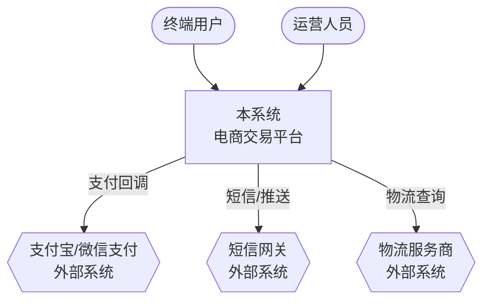
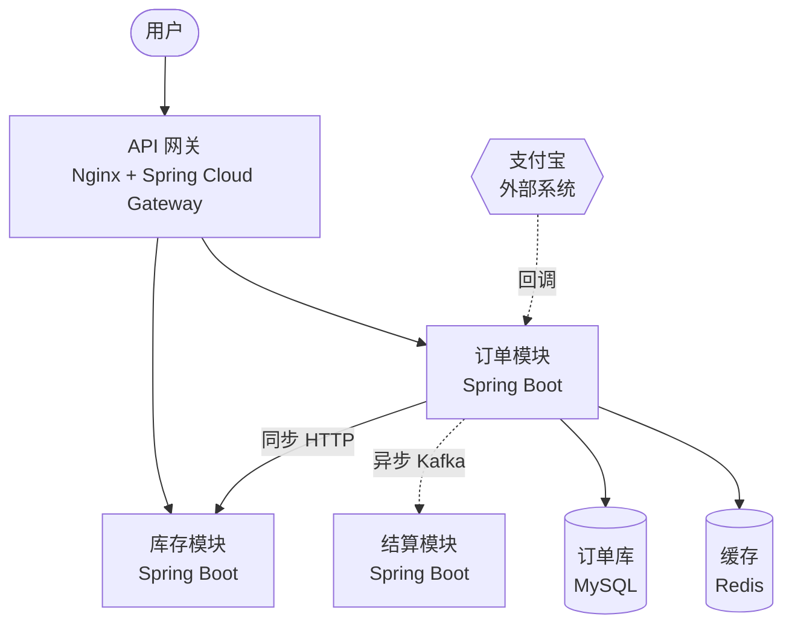
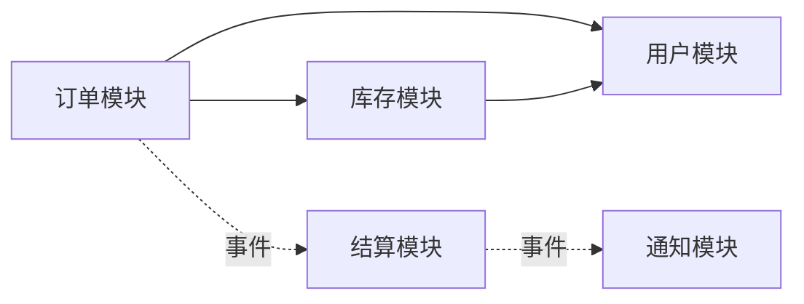
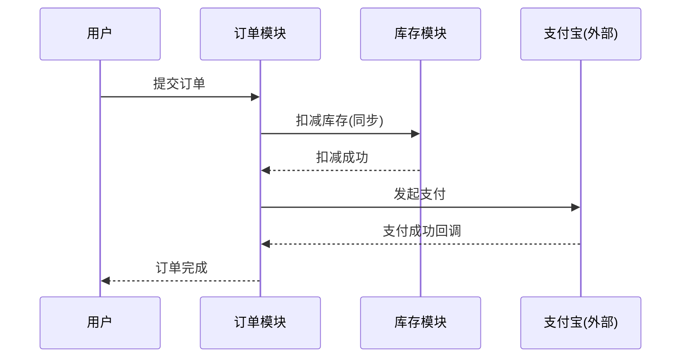
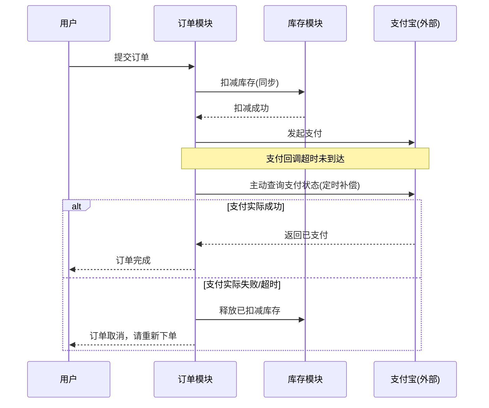
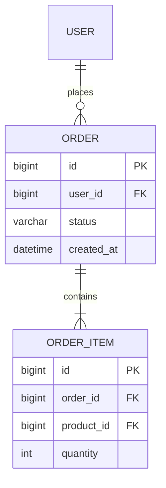
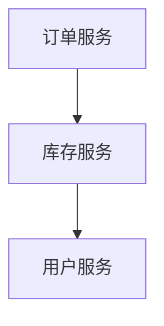

# 架构图规范（Mermaid）

## 必画四张图

1. **系统上下文图** —— 本系统 + 用户角色 + 外部系统，看清系统边界在哪里
2. **容器图** —— 进程/服务/存储/中间件，标注技术栈和通信协议
3. **模块依赖图** —— 逻辑模块 + 依赖方向，用来验证模块划分是否无环
4. **关键流程时序图** —— 最核心的 1-3 条链路，其中**必须有一条是失败/异常
   路径**（如下单超时、支付回调丢失）——这是最能暴露架构缺陷的图，不能只画
   Happy Path

按需补充：ER 图、状态机图、部署拓扑图。

## 通用绘制规范

- 节点必须标注技术栈，不写光秃秃的"订单服务"，要写"订单服务（Spring Boot）"
- 边必须标注协议 + 同步/异步：实线代表同步调用，虚线代表异步
- 存储类节点用 `[()]`（圆柱形），外部系统用 `{{}}`（六边形），视觉上一眼区分
- **单张图不超过 15 个节点**，超出就按子系统分层拆成多张图——看不懂的图
  等于没画

## 模板 1：系统上下文图

## 模板 2：容器图

## 模板 3：模块依赖图

绘制后检查：图中不能出现环（如 A→B→C→A），出现环即说明模块边界需要重新
划分。

## 模板 4：关键流程时序图（含异常路径）

正常路径：

异常路径（必须画）：

## 模板 5：ER 图（按需）

## 常见错误示范（反例）

错在哪：节点没有技术栈标注、边没有协议和同步/异步标注、看不出这是内部
调用还是跨系统调用。对照模板 2 重写。
